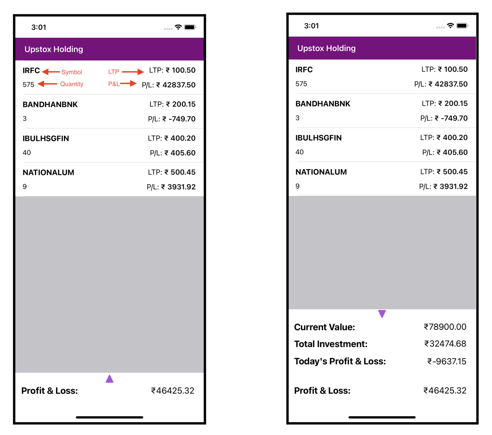

# Upstox Holdings
This project provides a list of holdings (stocks invested) and populate the list as per the below screenshots.



The data to parse is given below:

```json
{
   "userHolding": [
      {
         "symbol": "TCS",
         "quantity": 10,
         "ltp": 3250.50,
         "avgPrice": 2480.30,
         "close": 3312
      },
      {
         "symbol": "Wipro",
         "quantity": 80,
         "ltp": 550.20,
         "avgPrice": 380.30,
         "close": 580
      },
      {
         "symbol": "SBI",
         "quantity": 12,
         "ltp": 650.50,
         "avgPrice": 680.30,
         "close": 613
      },
      {
         "symbol": "TataMotors",
         "quantity": 100,
         "ltp": 650.50,
         "avgPrice": 280.30,
         "close": 780
      },
      {
         "symbol": "Reliance",
         "quantity": 10,
         "ltp": 2887.10,
         "avgPrice": 2780.30,
         "close": 2610
      }
   ]
}
```
## Module Usage
The app uses the following modules:
- react-redux
- @reduxjs/toolkit
- axios
- react-native-gesture-handler
- react-native-reanimated
- @gorhom/bottom-sheet


# Steps to run the app

>**Note**: Make sure you have completed the [React Native - Environment Setup](https://reactnative.dev/docs/environment-setup) instructions till "Creating a new application" step, before proceeding.

## Step 1: Start the Metro Server

First, you will need to start **Metro**, the JavaScript _bundler_ that ships _with_ React Native.

To start Metro, run the following command from the _root_ of your React Native project:

```bash
# using npm
npm start

# OR using Yarn
yarn start
```

## Step 2: Start your Application

Let Metro Bundler run in its _own_ terminal. Open a _new_ terminal from the _root_ of your React Native project. Run the following command to start your _Android_ or _iOS_ app:

### For Android

```bash
# using npm
npm run android

# OR using Yarn
yarn android
```

### For iOS

```bash
# using npm
npm run ios

# OR using Yarn
yarn ios
```

If everything is set up _correctly_, you should see your new app running in your _Android Emulator_ or _iOS Simulator_ shortly provided you have set up your emulator/simulator correctly.

This is one way to run your app — you can also run it directly from within Android Studio and Xcode respectively.

## Congratulations! :tada:

You've successfully run the sample Upstox Holding app. :partying_face: